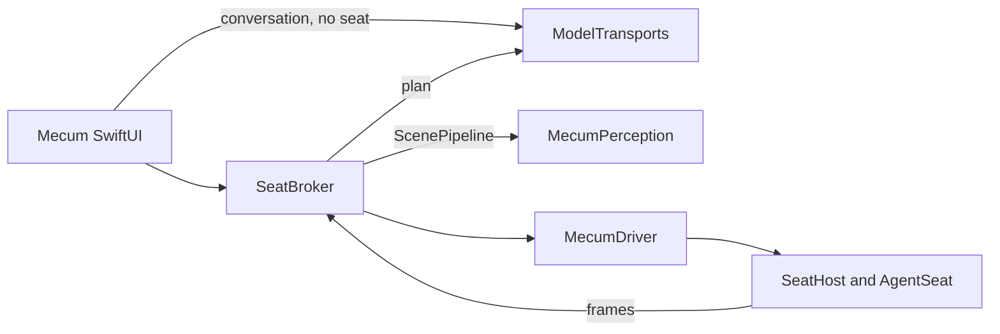

# SeatBroker context

`SeatBroker` is the reusable application-facing runtime, under
`Sources/SeatBroker` with its tests under `Tests/SeatBrokerTests`. It turns a
captured scene into `SemanticAction` values, asks Mecum to execute each action,
and verifies the resulting scene.

It perceives through the Perception layer (`MecumPerception`, described in
`Documentation/Perception/README.md`) and through nothing else. One
`ScenePipeline` is composed in `SeatBroker.init` over that layer's adapters:
`VisionTextRecognizer` for text, `ConnectedComponentSegmenter` with
`MediaRegionFilter` for regions, `ColorSectionDetector` for panels, and
`AccessibilityAugmenter` under a 0.35 s budget as the stage that only ever
adds. The pipeline never captures: the frame is the seat's own
`SeatObservationDelivery`, and the `ScenePipeline.Window` it is perceived
against carries the window server's frame from the seat's
`WindowGeometryObservation`, never an accessibility one. `SceneMapper` numbers
the resulting `SceneSnapshot` from one, which is the index a `SemanticAction`
names and `ActionExecutor` aims the command at.

Verification is the Engine's and no longer this lab's. `ActOracle.of` derives
the oracle from the action and from the surface the Command was aimed at,
before the first event goes out: a `type` into an accessibility field is held
to that field's own value, a click on a stateful control to its state, and
everything else to the closure of the surface, read from the window server by
identity. `ActVerification` consults that oracle before its scene difference,
and `OutcomeVerifier` is what is left here: the two measurements the Engine
does not carry (the encoded `SceneDifference` and the mean pixel delta) and the
mapping onto `ActionOutcome`, whose `symbol` and `sentence` the Lab shows. An
action with no oracle, a scroll or most chords, reaches `sceneChanged` and no
higher: a scene that changed is a measurement, never a verification, and this
lab does not promote one even where the two-scene rule alone would. A Command
that went out and whose after-frame could not be read keeps its verified effect
when the surface's own identity still proves it, and is `interruptedAfterPost`
otherwise, which nothing repeats.

The Lab's own locator modules are gone. What they did better lives on in the
Perception layer as roles (`ControlStateReading`, `PopupRowReading`,
`IncrementalText`) and in the Engine's `ActOracle`; the rest the layer already
covered. Scrolling an element into view has no planner any more: `ActionEngine`
has no scroll verb and this runtime posts a plain scroll through the seat, so a
scroll role is written when a consumer asks for one.

Talking to a model is not this runtime's job either. The transports live in
`Sources/ModelTransports` behind `ModelTransport`, which offers one structured
request (`complete`, returning the provider's raw text and its `ModelUsage`)
and one streamed conversational turn (`converse`, a stream of text deltas
closed by a single terminal element). A transport that cannot carry a
conversation declares so through `streaming` and throws
`ModelTransportError.streamingUnsupported`, which is what both CLI providers
do. What stays here is the planner's own vocabulary: `AgentPlanner` builds the
prompt and the schema, calls `complete`, and decodes the answer itself with
`PlanSchema.decodePlan`; which schema flavor and which prompt shape a provider
gets are `PlanSchema.flavor(for:)` and
`PlannerPrompt.prefersCompactPrompt(_:)`, not properties of the transport. The
app depends on `ModelTransports` directly, so it can hold a plain conversation
with a model without acquiring a seat at all.

Brokering a seat is all it does: it names no lease, scheduler, or other
ownership model of its own. Those responsibilities already have precise owners
in the driver:

- `SeatHost` owns the virtual display and cursor fence.
- `AgentSeat` owns an assignment, its adopted windows, recovery, and
  restitution.
- `Turn` is the driver's bounded exclusive use of an existing assignment. It
  is deliberately not called a lease.

`AgentSession` is an application-lifecycle facade. It records provenance and
uses an existing `AgentSeat`; it does not arbitrate between applications or
hold display authority.

The SwiftUI Lab is a direct consumer of the `SeatBroker` package
product. Its app target owns chat presentation, preferences, keychain access,
and view state. It does not duplicate runtime or perception code.

## Product boundary

A semantic click may carry a bounded `count`. The parser accepts `/click N`
for one click and `/click N C` for `C` complete clicks, where `C` is within
`InputCommand.maximumClickCount`. The driver remains the sole authority that
constructs the individual input events and rejects invalid input counts.

## Seat release rule

A worker's `BrokeredAutomationSession` keeps the seat after its turn ends for
30 seconds without another turn (`BrokeredAutomationSession.idleWindow`), then
closes on its own. A follow-up inside that window reuses the open session and
its context with no second `open`, and starting a turn cancels the pending
close. An entry that starts waiting in `SeatQueue` makes an idle holder close
at once, and a holder in a turn close as that turn ends. Nothing is released
inside a turn. Every release is `close()`: the Brain is flushed, the window
goes back to the person's display, an application the agent launched is quit
as its provenance says, and the lease is given back, so the worker's row goes
back to its role. The idle wait is tied to the lease it was started under, so
one that outlives a close, whether by hand or by the queue, closes nothing.

Each turn's prompt opens with the seat as the turn begins
(`BrokeredAutomationSession.turnStatus`): the live session's ID with its
application and window, or, once released, the application and window the last
session had. The agent observes or reopens it directly, with no `status` or
`windows` call first. Nothing reopens on its own.

## After a crash

A process that ends without `applicationShouldTerminate` (a crash, `kill -9`)
skips every release the app does on Quit. What the next launch reconciles, and
what it does not, as of 23 September 2026:

- A worker's turn is ended at the next launch, before any turn starts: its
  execution gets one `executionFailed`, the person's message reads interrupted,
  the partial reply stays, and nothing is run again
  (`WorkerTurnRecorder.endTurnsLeftUnfinished`). A turn that ended before its
  message was updated gets the message its ending implies: completed for
  `executionCompleted`, interrupted for any other ending.
- The turn's agent child (`claude -p`, `codex exec`) is reparented to launchd
  and keeps running until its next write to the pipe the app held, or longer if
  it ignores `SIGPIPE`. Its pid, start time and executable are recorded when it
  is spawned, and the next launch sends it `SIGTERM` only when all three still
  match and its parent is launchd. A child spawned in the instant before that
  record is written is not known to the next launch.
- **Known limit.** A window a seat adopted stays where the window server leaves
  it when the virtual display goes, and the display arrangement `SeatHost`
  committed for the login session (`.forSession`) is put back only by
  `SeatHost.stop`. Nothing records the
  window's original frame or display to disk (`AdoptedWindow.originalFrame` is
  in memory only), and nothing at launch looks for a window an earlier process
  took. What the window server does with that window has not been measured.
