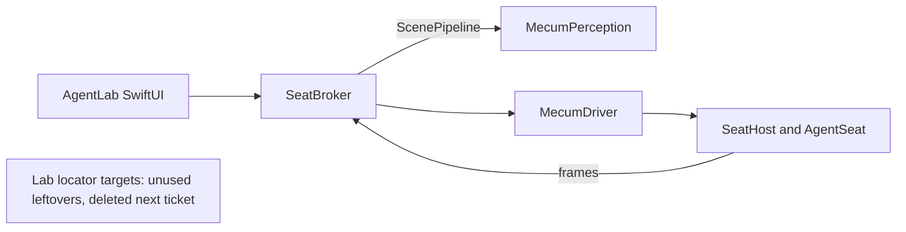

# SeatBroker context

`SeatBroker` is the reusable application-facing runtime, under
`Sources/SeatBroker` with its tests under `Tests/SeatBrokerTests`. It turns a
captured scene into `SemanticAction` values, asks Mecum to execute each action,
and verifies the resulting scene.

It perceives through the Perception layer (`MecumPerception`, described in
`Documentation/Perception/README.md`) and through nothing else. One
`ScenePipeline` is composed in `SeatBroker.init` over that layer's adapters:
`VisionTextRecognizer` for text, `ConnectedComponentSegmenter` with
`MediaRegionFilter` for regions, `ColorSectionDetector` for panels, and
`AccessibilityAugmenter` under a 0.35 s budget as the stage that only ever
adds. The pipeline never captures: the frame is the seat's own
`SeatObservationDelivery`, and the `ScenePipeline.Window` it is perceived
against carries the window server's frame from the seat's
`WindowGeometryObservation`, never an accessibility one. `SceneMapper` numbers
the resulting `SceneSnapshot` from one, which is the index a `SemanticAction`
names and `ActionExecutor` aims the command at, and `OutcomeVerifier` reads
`SceneDifference` over two snapshots.

The Lab's own locator modules (`LocatorCore`, `AXSupport`, `CaptureSupport`,
`OCRSupport`, `CVBackend`, `Relocation`) are leftovers: no source under
`Sources/SeatBroker` imports one any more and they are no part of any product.
Deleting their targets is the next ticket.

Brokering a seat is all it does: it names no lease, scheduler, or other
ownership model of its own. Those responsibilities already have precise owners
in the driver:

- `SeatHost` owns the virtual display and cursor fence.
- `AgentSeat` owns an assignment, its adopted windows, recovery, and
  restitution.
- `Turn` is the driver's bounded exclusive use of an existing assignment. It
  is deliberately not called a lease.

`AgentSession` is an application-lifecycle facade. It records provenance and
uses an existing `AgentSeat`; it does not arbitrate between applications or
hold display authority.

The SwiftUI Lab is a direct consumer of the `SeatBroker` package
product. Its app target owns chat presentation, preferences, keychain access,
and view state. It does not duplicate runtime or perception code.

## Product boundary

A semantic click may carry a bounded `count`. The parser accepts `/click N`
for one click and `/click N C` for `C` complete clicks, where `C` is within
`InputCommand.maximumClickCount`. The driver remains the sole authority that
constructs the individual input events and rejects invalid input counts.
