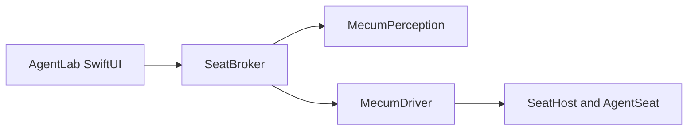

# SeatBroker context

`SeatBroker` is the reusable application-facing runtime, under
`Sources/SeatBroker` with its tests under `Tests/SeatBrokerTests`. It turns a
captured scene into `SemanticAction` values, asks Mecum to execute each action,
and verifies the resulting scene. The locator, accessibility, capture, OCR,
CV and relocation modules it still reads scenes through (`LocatorCore`,
`AXSupport`, `CaptureSupport`, `OCRSupport`, `CVBackend`, `Relocation`) are
internal targets of this product and no part of `MecumPerception`, which is the
Perception layer described in `Documentation/Perception/README.md`; the
runtime is to consume that layer instead, ticket by ticket.

Brokering a seat is all it does: it names no lease, scheduler, or other
ownership model of its own. Those responsibilities already have precise owners
in the driver:

- `SeatHost` owns the virtual display and cursor fence.
- `AgentSeat` owns an assignment, its adopted windows, recovery, and
  restitution.
- `Turn` is the driver's bounded exclusive use of an existing assignment. It
  is deliberately not called a lease.

`AgentSession` is an application-lifecycle facade. It records provenance and
uses an existing `AgentSeat`; it does not arbitrate between applications or
hold display authority.

The SwiftUI Lab is a direct consumer of the `SeatBroker` package
product. Its app target owns chat presentation, preferences, keychain access,
and view state. It does not duplicate runtime or perception code.

## Product boundary

A semantic click may carry a bounded `count`. The parser accepts `/click N`
for one click and `/click N C` for `C` complete clicks, where `C` is within
`InputCommand.maximumClickCount`. The driver remains the sole authority that
constructs the individual input events and rejects invalid input counts.
