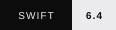

<h1 align="center">
  <picture>
    <source media="(prefers-color-scheme: dark)" srcset="readme-assets/mecum-wordmark-dark.svg" />
    <source media="(prefers-color-scheme: light)" srcset="readme-assets/mecum-wordmark-light.svg" />
    
  </picture>
</h1>

<p align="center"><strong>Let agents work in your apps while you keep using your Mac.</strong></p>

<p align="center">Mecum gives agents a desktop workspace on your Mac. Give a worker a task in the Mecum app, or connect Claude Code or Codex through MCP to work in desktop apps, even when they expose neither an API nor an AX tree.</p>

<p align="center">
  
  <a href="Documentation/README.md"></a>
  <a href="https://discord.gg/SBqrAN9wDg"></a>
  <a href="https://x.com/wearemecum"></a>
</p>

<p align="center">
  <a href="#license"></a>
  <a href="Package.swift"></a>
</p>

## See Mecum in action

<div align="center">

https://github.com/user-attachments/assets/83ced839-9b8d-47fe-8e27-f64f53a0d1f7

</div>

## Get started

Mecum runs on **macOS 15+**, on **Apple silicon and Intel**. Follow the [installation guide](Documentation/README.md#get-started) to get set up.

1. Install and open Mecum.
2. Create a worker, connect a supported model and grant the Mac access needed for desktop work.
3. Start with a small task in a disposable document. Name the app, the result you want and where the agent should stop.
4. Follow the activity and inspect the result in the app.

For your first task, ask the agent to read an open TextEdit test document and summarize it without editing or saving.

If you use Codex or Claude Code, keep their CLIs up to date to access the latest models available to your account.

To build from source with **Swift 6.4**, follow the [developer Quickstart](QUICKSTART.md).

<details>
<summary>Connect Claude Code, Codex or another local MCP client</summary>

<br>

Mecum and your client must run on the same Mac. The app includes the STDIO bridge; no Node.js or Python installation is needed.

1. Keep Mecum open. In **MCP → MCP Connections…**, name your client, choose its capabilities and click **Add Client**.
2. Turn **Enabled** on and wait for **Ready**.
3. Expand **Client configuration** and use **Copy Claude Code command**, **Copy Codex command** or **Copy JSON**. Prefer these generated values over the templates below.

**Claude Code**

```sh
claude mcp add --scope user --transport stdio mecum -- \
  "/Applications/Mecum.app/Contents/Helpers/mecum-bridge" \
  mcp-bridge --connection \
  "/Users/YOUR_USERNAME/Library/Application Support/Mecum/MCP/CLIENT_UUID.connection.json"
```

**Codex**

```sh
codex mcp add mecum -- \
  "/Applications/Mecum.app/Contents/Helpers/mecum-bridge" \
  mcp-bridge --connection \
  "/Users/YOUR_USERNAME/Library/Application Support/Mecum/MCP/CLIENT_UUID.connection.json"
```

These are templates. Replace `YOUR_USERNAME` and `CLIENT_UUID` with the values from Mecum, and use the generated helper path if the app is elsewhere. Keep paths quoted. Save configurations in personal settings.

Check registration with `claude mcp get mecum` or `codex mcp list`. Start a new client session and use `/mcp` to inspect the live connection, then run the [read-only connection check](Documentation/MCPSetup.md#test-the-connection).

Each connection entry accepts one active client. Create separate entries for independently running clients. Never share the contents of `*.connection.json`.

The [full MCP guide](Documentation/MCPSetup.md) covers other local clients, capabilities and troubleshooting. Not every client has been tested end to end. URL-only web connectors cannot use this local bridge.

</details>

## What works today

Supported frameworks: **AppKit, Chromium, Electron and Qt**. UXP support is in development (Adobe apps).

Workers take turns controlling desktop apps. While one works, the others wait in line.

Read the [compatibility and limitations guide](Documentation/LaunchCompatibility.md) for the current scope and how to report a workflow.

## How it works

- **[Driver](Documentation/Driver/README.md):** written in Swift, it moves app windows to a virtual display and routes the agent's input there, so you can keep working on your Mac without a virtual machine.
- **[Perception](Documentation/Perception/README.md):** turns the current interface into structured text and refreshes it as the window changes.
- **[Brain](Documentation/README.md#brain):** builds a map of each app's controls, relationships and transitions, giving agents context about how the app works.
- **[Memory](Documentation/README.md#memory):** stores past interactions and their outcomes, so agents can draw on that experience in later tasks (still in development; recall can be inconsistent, with improvements on the way).

Driver, Perception and Engine are [Swift package libraries](Package.swift) you can use in your own macOS apps.

Mecum checks what changed after each action. You can follow the activity, review the result and stop the worker from the app.

The desktop window-to-text pipeline runs locally. A remote model can receive window text, task context and relevant app knowledge. Read [Permissions & data](Documentation/README.md#permissions-and-data).

## Benchmarks

Mecum's full-scene responses used **85–97% fewer estimated tokens** than Cua's screenshot + AX tree responses.

### Driver comparison

8 runs after 1 warm-up. Times include the action and updated view.

<table border="1" cellspacing="0" cellpadding="8">
  <thead>
    <tr><th scope="col" align="left">Application / framework</th><th scope="col">Mecum support</th><th scope="col">Cua support</th><th scope="col">Mecum step (ms)</th><th scope="col">Cua step (ms)</th></tr>
  </thead>
  <tbody>
    <tr><th scope="row" align="left">TextEdit (AppKit)</th><td>Partial</td><td>Supported</td><td>1,069</td><td>1,489</td></tr>
    <tr><th scope="row" align="left">Chrome (Chromium)</th><td>Partial</td><td>Supported</td><td>1,227</td><td>1,590</td></tr>
    <tr><th scope="row" align="left">Obsidian (Electron)</th><td>Supported</td><td>Supported</td><td></td><td>1,513</td></tr>
    <tr><th scope="row" align="left">Stocks (Mac Catalyst)</th><td>Unavailable</td><td>Supported</td><td>—</td><td>2,061</td></tr>
    <tr><th scope="row" align="left">kitty (OpenGL/GLFW)</th><td>Partial</td><td>Partial</td><td></td><td>1,602</td></tr>
    <tr><th scope="row" align="left">DaVinci Resolve (Qt + GPU UI)</th><td>Supported</td><td>Not supported</td><td></td><td>—</td></tr>
    <tr><th scope="row" align="left">Prism Launcher (Qt 6)</th><td>Supported</td><td>Not supported</td><td></td><td>—</td></tr>
    <tr><th scope="row" align="left">Calculator (SwiftUI)</th><td>Supported</td><td>Supported</td><td></td><td>1,355</td></tr>
    <tr><th scope="row" align="left">Safari (WebKit)</th><td>Partial</td><td>Partial</td><td></td><td>1,385</td></tr>
  </tbody>
</table>

See the [full report](Documentation/Driver/reports/CUADriverBenchmark20261006.md) for the method and support limits.

### Perception context per read

Estimated tokens in the tool response, rather than total tokens for a task with a model:

<table border="1" cellspacing="0" cellpadding="8">
  <thead>
    <tr><th scope="col" align="left">Application / framework</th><th scope="col">Mecum full read</th><th scope="col">Mecum unchanged</th><th scope="col">Cua full read</th></tr>
  </thead>
  <tbody>
    <tr><th scope="row" align="left">TextEdit (AppKit)</th><td></td><td></td><td>6,185</td></tr>
    <tr><th scope="row" align="left">Chrome (Chromium)</th><td></td><td></td><td>13,986</td></tr>
    <tr><th scope="row" align="left">Obsidian (Electron)</th><td></td><td></td><td>7,307</td></tr>
    <tr><th scope="row" align="left">kitty (OpenGL/GLFW)</th><td></td><td></td><td>4,566</td></tr>
    <tr><th scope="row" align="left">DaVinci Resolve (Qt + GPU UI)</th><td></td><td></td><td>17,924</td></tr>
    <tr><th scope="row" align="left">Prism Launcher (Qt 6)</th><td></td><td></td><td>4,157</td></tr>
    <tr><th scope="row" align="left">Calculator (SwiftUI)</th><td></td><td></td><td>3,801</td></tr>
    <tr><th scope="row" align="left">Safari (WebKit)</th><td></td><td></td><td>34,002</td></tr>
  </tbody>
</table>

**Full read:** the complete view, as structured text for Mecum or screenshot + AX tree for Cua.

**Unchanged:** no changes since the previous step. Mecum sends a short confirmation; Cua sends the full view again.

Test hardware: MacBook Pro with M4 (base model), 16 GB RAM, macOS 27.0.1 (26A434).

[Read the method, results and per-operation data →](Documentation/Driver/reports/CUADriverBenchmark20261006.md)

## Contribute

We welcome help with Qt driver coverage, UXP and Flutter support, missing Perception controls, and feedback on Brain and Memory as you use apps. Start with [CONTRIBUTING.md](CONTRIBUTING.md) and [GitHub Issues](https://github.com/ForteAI-Org/mecum/issues).

For questions and workflows, join [Discord](https://discord.gg/SBqrAN9wDg).

## License

[Apache 2.0](https://www.apache.org/licenses/LICENSE-2.0), Copyright 2026 Forte Audio S.r.l.
